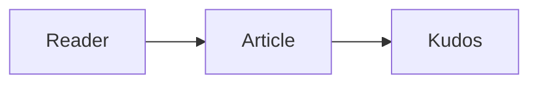

# Hugo ✨ Bear Neo

> Free, no-nonsense, super-fast blogging.

[English](./README.md) | [简体中文](./docs/README_zh.md)

🧸 A [Hugo](https://gohugo.io/) theme based on [Bear Blog](https://bearblog.dev).

Transplanted from [Hugo Bear Blog][hugo-bearblog], because the original author chose to maintain consistency with the root original [Bear Blog](https://bearblog.dev), so I chose to create a more extensible and feature-rich [Hugo Bear Blog][hugo-bearblog].

**Guidelines**

1. Continue to uphold the philosophy of [Bear Blog](https://bearblog.dev)
2. Ensure the ability to revert to configurations identical to [Hugo Bear Blog][hugo-bearblog] or even to [Bear Blog](https://bearblog.dev) itself

**TOC**

- [✨ Features](#-features)
- [🐻 Demo](#-demo)
- [🚀 Quick start](#-quick-start)
- [📑 User Manual](#-user-manual)
  - [Upvote posts](#upvote-posts)
  - [Search post](#search-post)
  - [Post list page grouped by year](#post-list-page-grouped-by-year)
  - [Table of contents](#table-of-contents)
  - [Image zoom](#image-zoom)
  - [Mermaid diagrams](#mermaid-diagrams)
  - [External links](#external-links)
  - [Follow App Claim](#follow-app-claim)
- [🎁 Acknowledgments](#-acknowledgments)
- [©️ License](#️-license)

## ✨ Features

Based on [Hugo Bear Blog][hugo-bearblog], the following features have been added:

- [x] Upvote posts (Highlight feature 👍, inspired by Bear Blog and powered by Kudos)
- [x] Search post
- [x] Post list page grouped by year
- [x] Table of contents
- [x] Image zoom
- [x] Mermaid diagrams
- [x] External link handling
- [x] Follow App Claim

There are still some optimization items:

- Add canonical metadata, better SEO
- Support RSS
- More abundant Footer content
- ...

## 🐻 Demo

For a current & working demo of this theme, please check out [https://rokcso.com/][rokcso-blog] 🎯.

## 🚀 Quick start

This theme requires Hugo v0.110.0 or later. From the root of your Hugo site, clone the theme into the `themes` directory:

```bash
git clone https://github.com/rokcso/hugo-bearneo.git themes/hugo-bearneo
```

Add the theme name to your site's `hugo.toml`:

```toml
theme = "hugo-bearneo"
```

Start the local server:

```bash
hugo server
```

See the options below to enable features such as post search, table of contents, image zoom, and upvotes.

## 📑 User Manual

### Upvote posts

This theme provides Bear Blog-style upvotes, powered by [Kudos](https://github.com/puinoib/kudos), a Cloudflare Workers + D1 service. Deploy Kudos first, then configure its URL as the Upvote endpoint.

Kudos associates each upvote count with its page, so changing the site's domain does not reset an article's upvote count.

Then add the following configuration to the Hugo blog configuration file `hugo.toml`:

```toml
[params]
    upvote = true
    upvoteURL = "https://kudos.example.com"
```

`upvoteURL` may include or omit a trailing `/`.

### Search post

Display a search box on the post list page and enter post title keywords to search for specific posts.

Add the following configuration to the Hugo blog configuration file `hugo.toml`:

```toml
[params]
    postSearch = true
```

### Post list page grouped by year

Add the following configuration to the Hugo blog configuration file `hugo.toml`:

```toml
[params]
    groupByYear = true
```

### Table of contents

Add the following configuration to the Hugo blog configuration file `hugo.toml`:

```toml
[params]
    toc = true
```

### Image zoom

Add the following configuration to the Hugo blog configuration file `hugo.toml`:

```toml
[params]
    imageZoom = true
```

### Mermaid diagrams

Set `mermaid: true` in a page's front matter, then use a Mermaid fenced code block in its Markdown content. Mermaid JavaScript loads only on pages that opt in.

````markdown
---
mermaid: true
---


````

### External links

Set this option to open external HTTP(S) links in a new tab. Internal links continue to open in the current tab. External links receive `rel="noopener noreferrer"` in either mode.

```toml
[params]
    externalLinksNewTab = true
```

### Follow App Claim

[Follow](https://follow.is/) is an RSS subscription tool. As a blog creator, claiming your blog on Follow allows you to receive $POWER tips from blog readers through Follow. I once wrote an [article](https://rokcso.com/p/follow-claim-feed-en/) explaining how to claim your blog on Follow.

The hugo-bearneo natively supports the "Scheme III: RSS Tag" mentioned in my article. You only need to add the following configuration to the Hugo blog configuration file `hugo.toml`:

```toml
[params.RSS]
    followFeedId = "00000000000000000"
    followUserId = "00000000000000000"
```

Note: Please remember to replace the Follow id in the configuration with your own!

## 🎁 Acknowledgments

A special thank you goes out to [Herman](https://herman.bearblog.dev), for creating the original [ʕ•ᴥ•ʔ Bear Blog](https://bearblog.dev/).

Another special thanks to janraasch, without his [hugo-bearblog][hugo-bearblog], there would not be [hugo-bearneo][hugo-bearneo].

## ©️ License

[MIT License](http://en.wikipedia.org/wiki/MIT_License) © [Rokcso][rokcso-blog]

[hugo-bearblog]: https://github.com/janraasch/hugo-bearblog
[hugo-bearneo]: https://github.com/rokcso/hugo-bearneo
[rokcso-blog]: https://rokcso.com/
