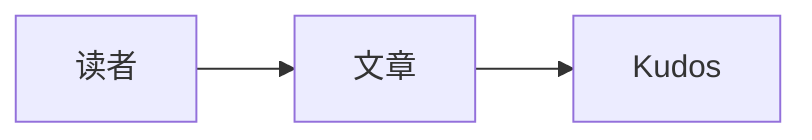

# Hugo ʕ•ᴥ•ʔ Bear Blog ✨ Neo

> 免费、简洁、超快速的博客。

[English](../README.md) | [简体中文](./README_zh.md)

基于 [Bear Blog](https://bearblog.dev/) 的 [Hugo](https://gohugo.io/) 主题。

从 [Hugo Bear Blog][hugo-bearblog] 移植而来，由于原作者选择与原版 [Bear Blog](https://bearblog.dev) 保持一致，因此我选择创建一个更具扩展性和功能丰富的 [Hugo Bear Blog][hugo-bearblog]。

**准则**

1. 继续坚持 [Bear Blog](https://bearblog.dev) 的理念
2. 保证能通过配置还原到和 [Hugo Bear Blog][hugo-bearblog] 甚至是和 [Bear Blog](https://bearblog.dev) 一致

**目录**

- [✨ 功能](#-功能)
- [🐻 示例](#-示例)
- [🚀 快速开始](#-快速开始)
- [📑 使用手册](#-使用手册)
    - [文章点赞](#文章点赞)
    - [搜索文章](#搜索文章)
    - [文章列表页按年份分组](#文章列表页按年份分组)
    - [显示目录](#显示目录)
    - [图片缩放](#图片缩放)
    - [Mermaid 图表](#mermaid-图表)
    - [外部链接](#外部链接)
    - [Follow App Claim](#follow-app-claim)
- [🎁 鸣谢](#-鸣谢)
- [©️ License](#️-license)

## ✨ 功能

在 [Hugo Bear Blog][hugo-bearblog] 的基础上，增加了以下功能：

- [x] 文章点赞（亮点功能 👍，灵感来自 Bear Blog，由 Kudos 提供后端支持）
- [x] 搜索文章
- [x] 文章列表页按年份分组
- [x] 显示目录
- [x] 图片缩放
- [x] Mermaid 图表
- [x] 外部链接处理
- [x] Follow App Claim

还有一些优化项：

- 添加 canonical 元数据，更好的 SEO
- 支持 RSS
- 更丰富的 Footer 内容
- ……

## 🐻 示例

要查看此主题的最新状态和实际演示，请访问 [https://rokcso.com/][rokcso-blog] 🎯。

## 🚀 快速开始

此主题需要 Hugo v0.110.0 或更高版本。在 Hugo 站点根目录中，将主题克隆到 `themes` 目录：

```bash
git clone https://github.com/rokcso/hugo-bearneo.git themes/hugo-bearneo
```

在站点的 `hugo.toml` 中配置主题名称：

```toml
theme = "hugo-bearneo"
```

启动本地预览服务器：

```bash
hugo server
```

下方的配置项可用于启用文章搜索、目录、图片缩放和点赞等功能。

## 📑 使用手册

### 文章点赞

主题提供 Bear Blog 风格的文章点赞功能，后端由 [Kudos](https://github.com/puinoib/kudos) 提供。先部署基于 Cloudflare Workers + D1 的 Kudos 服务，再将其 URL 配置为点赞接口。

Kudos 会将点赞数关联到对应页面，因此更换站点域名不会重置文章的点赞数。

然后在 Hugo 博客配置文件 `hugo.toml` 中添加如下配置:

```toml
[params]
    upvote = true
    upvoteURL = "https://kudos.example.com"
```

`upvoteURL` 末尾可以带或不带 `/`。

### 搜索文章

在文章列表页面显示搜索框，输入文章标题关键词以搜索特定文章。

在 Hugo 博客配置文件 `hugo.toml` 中添加如下配置：

```toml
[params]
    postSearch = true
```

### 文章列表页按年份分组

在 Hugo 博客配置文件 `hugo.toml` 中添加如下配置:

```toml
[params]
    groupByYear = true
```

### 显示目录

在 Hugo 博客配置文件 `hugo.toml` 中添加如下配置:

```toml
[params]
    toc = true
```

### 图片缩放

在 Hugo 博客配置文件 `hugo.toml` 中添加如下配置:

```toml
[params]
    imageZoom = true
```

### Mermaid 图表

在文章 front matter 中设置 `mermaid: true`，然后在 Markdown 内容中使用 Mermaid fenced code block。Mermaid JavaScript 只会在启用该选项的文章页加载。

````markdown
---
mermaid: true
---


````

### 外部链接

启用后，外部 HTTP(S) 链接会在新标签页打开，站内链接仍在当前标签页打开。无论是否启用，外部链接都会带有 `rel="noopener noreferrer"`。

```toml
[params]
    externalLinksNewTab = true
```

### Follow App Claim

[Follow](https://follow.is/) 是一个 RSS 订阅工具，作为博客创作者，在 Follow 中 Claim 自己的博客可以接收博客读者通过 Follow 提供的 $POWER 打赏。对此我曾经写过一篇 [文章](https://rokcso.com/p/follow-claim-feed/) 介绍如何在 Follow 中 Claim 自己的博客。

而 hugo-bearneo 原生支持了我文章中提到的「方案三：RSS Tag」，只需要在 Hugo 博客配置文件 `hugo.toml` 中添加如下配置：

```toml
[params.RSS]
    followFeedId = "00000000000000000"
    followUserId = "00000000000000000"
```

注意：请记得将配置中的 follow id 替换为你自己的！

## 🎁 鸣谢

特别感谢 [Herman](https://herman.bearblog.dev)，他创建了最初的 [ʕ•ᴥ•ʔ Bear Blog](https://bearblog.dev/)。

特别感谢 janraasch，没有他的 [hugo-bearblog][hugo-bearblog]，就不会有 [hugo-bearneo][hugo-bearneo]。

## ©️ License

[MIT License](http://en.wikipedia.org/wiki/MIT_License) © [Rokcso][rokcso-blog]

[hugo-bearblog]: https://github.com/janraasch/hugo-bearblog
[hugo-bearneo]: https://github.com/rokcso/hugo-bearneo
[rokcso-blog]: https://rokcso.com/
